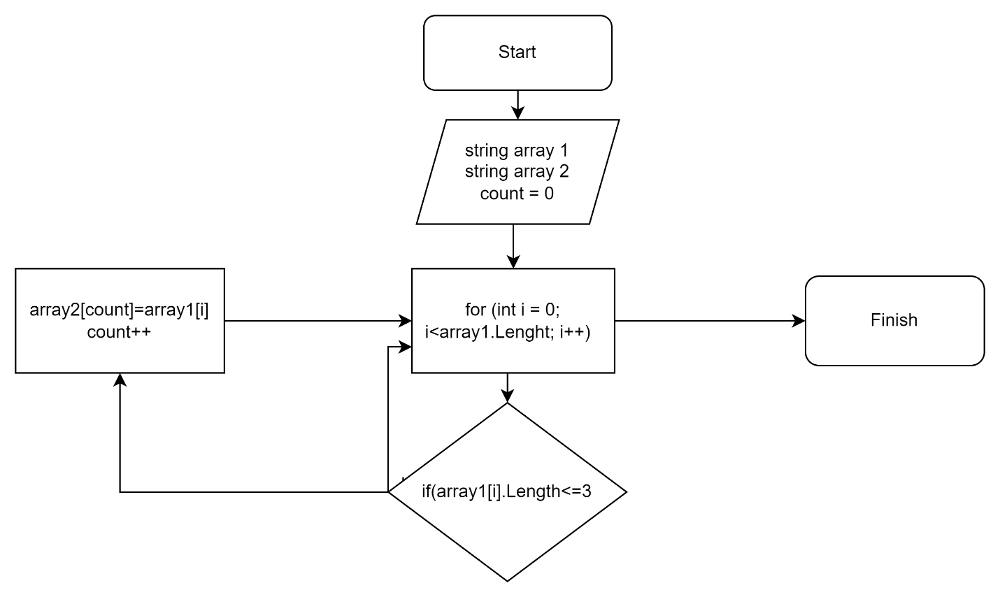

**Задача:** Написать программу, которая из имеющегося массива строк формирует массив из строк, длина которых меньше либо равна 3 символа. Первоначальный массив можно ввести с клавиатуры, либо задать на старте выполнения алгоритма. При решении не рекомендуется пользоваться коллекциями, лучше обойтись исключительно массивами.

**Примеры:**

[“Hello”, “2”, “world”, “:-)”] → [“2”, “:-)”]

[“1234”, “1567”, “-2”, “computer science”] → [“-2”]

[“Russia”, “Denmark”, “Kazan”] → []

**Алгоритм программы:**

Создаем массив, решаем методом, который будет выполнять требуемые операции и условия. Пишем цикл в котором будут перебираться элементы массива, в тело цикла добавляем условия выборки из условия задачи, если есть элемент удовлетворяющий условиям, тогда иннициализируется новый массив такого же типа и в ячейку нового массива записывается значение ячейки первичного массива.

